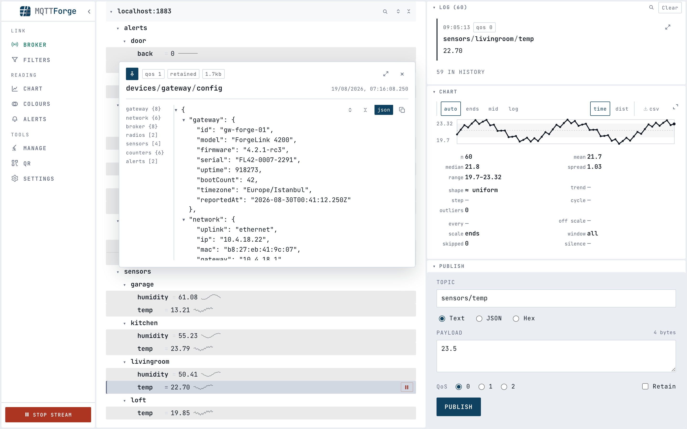
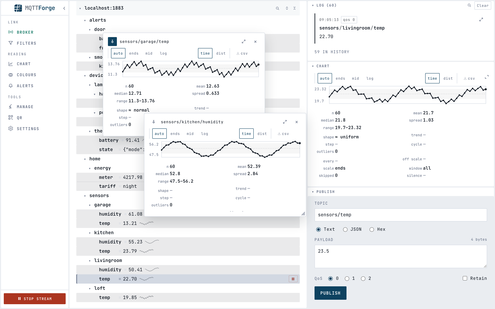

<picture>
  <source media="(prefers-color-scheme: dark)" srcset=".github/assets/lockup-dark.png">
  
</picture>

[](https://github.com/ibrahimilkhan/mqtt-forge/releases/latest)
[](LICENSE)

An MQTT test tool: connect to a broker, watch the traffic, chart it, publish back.

Open source, small and fast. It runs on macOS, Windows, Linux and Docker.


## What it does

- **Topic tree** — every topic the broker carries, with its latest value.
- **Log** — the newest message on whatever you pick, with its time, QoS and size, and the history
  behind it.
- **Charts** — any topic sending numbers gets a plot and a summary. A JSON body's fields are
  chartable by name.
- **Messages** — open one in its own window; a JSON body becomes a foldable document with an index.
- **Publish** — text, JSON or hex, with QoS and the retained flag. Any logged message loads back
  into the form.
- **Colour rules** — give a filter a colour and every topic it covers wears it.
- **Filters, QR, settings** — subscribe to a list of filters, open the session on your phone, set
  the fonts.

##  Download

### Desktop

[](https://github.com/ibrahimilkhan/mqtt-forge/releases/latest/download/MQTTForge-windows-x64.zip)
[](https://github.com/ibrahimilkhan/mqtt-forge/releases/latest/download/MQTTForge-linux-x64.tar.gz)
[](https://github.com/ibrahimilkhan/mqtt-forge/releases/latest/download/MQTTForge-macos-arm64.dmg)
[](https://github.com/ibrahimilkhan/mqtt-forge/releases/latest/download/MQTTForge-macos-x64.dmg)

<details>
<summary>The desktop builds are not signed, so each system asks once</summary>

Signing needs a paid certificate this project does not have.

- **macOS** — System Settings → Privacy & Security → **Open Anyway**, or right-click → Open on
  macOS 14 and earlier. Or `xattr -dr com.apple.quarantine /Applications/MQTTForge.app`.
- **Windows** — SmartScreen: More info → Run anyway.
- **Linux** — install `libwebkit2gtk-4.1-0` if no window appears.

</details>

### Docker

[](https://github.com/ibrahimilkhan/mqtt-forge/pkgs/container/mqtt-forge)

Run it as a container and open http://localhost:5169:

```
docker run -d -p 5169:5169 --name mqtt-forge ghcr.io/ibrahimilkhan/mqtt-forge
```

<details>
<summary>Running the container next to your broker</summary>

Inside a container `localhost` means the container. Use your broker's hostname or IP; for one on
this machine outside Docker, `host.docker.internal` (on Linux add
`--add-host=host.docker.internal:host-gateway`).

Certificates are read inside the container — mount them and give the panel the path in there:

```
docker run -d -p 5169:5169 -v ~/certs:/certs:ro ghcr.io/ibrahimilkhan/mqtt-forge
```

To keep settings across `docker rm`, name a settings file on a volume:

```
docker run -d -p 5169:5169 \
  -e MqttForge__SettingsPath=/data/connection-settings.json \
  -v mqtt-forge-data:/data \
  --name mqtt-forge ghcr.io/ibrahimilkhan/mqtt-forge
```

The desktop app keeps its files in the normal per-user folder.

> Both listen on all interfaces, which is what the QR panel needs. On a shared network use
> `-p 127.0.0.1:5169:5169`. The broker password is stored as plain text.

</details>

Either way, paste your broker's address into the panel that opens. `mqtts://host:8883` goes in
whole.

## Connecting

MQTT **5.0, 3.1.1 and 3.1**, over **`mqtt://`, `mqtts://`, `ws://` and `wss://`**. It offers 5.0
first and keeps whatever the broker accepts.

Client certificates, an extra CA, a server name and ALPN are under **Encryption**. Most brokers
need none of it.

A failed connection names the cause and what to do about it.

## Reading a message

Double-click a message to open it in its own window. A JSON body becomes a document you can fold,
with an index of its top level down the left. The mark in the corner copies what arrived.



## Charts

A topic sending numbers gets a plot and a summary: count, mean, median, spread, range, trend,
where it stepped, whether it cycles, and which readings do not belong.

The kind of run decides what is said. A temperature gets a mean and a trend; a door or a pump gets
counted and timed; a meter gets the rate it climbs at.

**auto**, **ends**, **mid** and **log** set the range — readings outside it are drawn on the edge
and counted. **time** and **dist** change the view, **csv** saves it.

Pin a chart as a window and it keeps its topic while you use the rest of the console.



## Colouring topics

Give the **Colours** panel a filter and a colour — `sensors/+/temp`, `alerts/#` — and every topic
it covers is drawn in it, in the tree and in the log. The more exact filter wins.


## Alerts

Give a rule a filter and a condition — `plant/+/temp` over 90 — and MQTTForge watches for it. A
rule that fires raises an alert. Pick what happens: a notice on screen, a tone, a POST to an
address you name, or the alert published back onto the broker. Any of the four, or all of them.

Rules are written in the **Alerts** panel. Each one opens in a window of its own, carrying the
fields its condition needs and nothing else. The panel lists what is ringing now, what each rule
is seeing — how many topics it covers, how many readings it has read, when it last fired — and
what has since ended.

A rule subscribes its own filter. Alerting works with the console shut, and in a container with
no browser pointed at it at all.

Conditions cover a threshold, a band, a text pattern, a set of values, and silence — a topic that
has stopped publishing. Four more ask about the readings as a run rather than one at a time: an
**outlier**, a reading unlike the ones before it; a **distribution shift**, readings that stop
being the shape they were; a **shape change**, a quantity that becomes a switch or a pulse train
that stops; and **pulse**, the count, duty, period or width of a signal's own rhythm. Those four
need no number from you — a rule that says "tell me when this line stops behaving as it does"
works without anybody knowing what it does. Each watches a window of 20 to 2000 readings and says
nothing until it has 20 of them, and the panel says how far along each topic is while it fills.
**for** waits for the state to hold before it fires, **cooldown** keeps a flapping sensor from
filling the panel, and muting a topic quietens it for a while without touching the rule.

An alert that is ringing shows in the corner of the console whatever you have open, and the
Alerts button in the rail carries the count while the panel is shut. A critical one stays until
you send it away; the other two fade. A notice goes when its alarm does — an alert the server no
longer holds leaves nothing behind on screen. The tone needs one click to start — no browser
makes a sound before somebody has clicked the page — and the console says so while it is waiting
for that click, rather than being on and silent.

An alarm survives a restart. What was ringing when the process stopped is still ringing when it
comes back, and an alarm whose rule was edited while the process was down ends rather than
returning.

Rules are kept in `alert-rules.json` beside your other settings. Webhook headers are stored in
that file as plain text; `MqttForge__AllowWebhooks=false` turns webhooks off altogether.
[SECURITY.md](SECURITY.md) says what that trade is. The editor shows the header names a rule
already has with an empty value box beside each: leave it empty and the stored value is kept.
Header values never come back out of the server.

## What it costs

Measured on a live tram feed:

| Holding | Taking it in | Drawing |
| --- | --- | --- |
| 128k messages · 6.7k topics · 36.8 MB | 1 ms per second | 47 fps |

The log keeps half a million messages and drops the oldest.

## Next

- **Automation** — run a scripted sequence of publishes and expected replies.
- **Recording** — save a session's traffic and play it back.
- **Load testing** — many clients at a sustained rate.

## Build it yourself

Needs .NET 10 and Node 22+.

```
dotnet run --project src/MqttForge.Api    # http://localhost:5169
npm --prefix web run dev                  # http://localhost:5173
```

`dotnet publish -c Release` builds everything into one process.
[CONTRIBUTING.md](CONTRIBUTING.md) has the rest.

## Ideas are welcome

Anything missing or broken — [open an
issue](https://github.com/ibrahimilkhan/mqtt-forge/issues). One sentence is enough.

## Licence

[AGPL-3.0](LICENSE).
