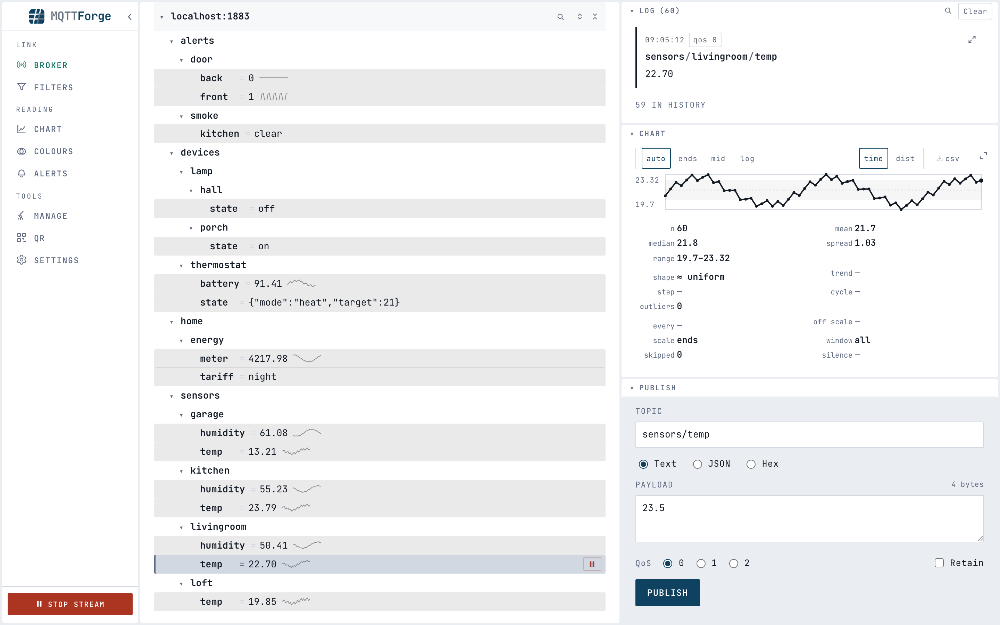

# MQTTForge

[](https://github.com/ibrahimilkhan/mqtt-forge/releases/latest)
[](https://github.com/ibrahimilkhan/mqtt-forge/pkgs/container/mqtt-forge)
[](LICENSE)

An open-source MQTT test console: connect to a broker, watch topics as they arrive, and publish
messages by hand. A .NET API drives an MQTT client and pushes what it receives to a React
interface over SignalR.

MQTTForge connects to a broker you already run — it is not a broker itself.



## What it does

- **Topic tree** — the broker's topology as it builds, with the latest payload on every branch.
- **Wire log** — every frame in and out, each row carrying its time, direction, QoS and size.
- **Publish** — text, JSON or hex, with QoS and the retained flag; any logged message reloads
  into the form for a resend.
- **Filters** — subscribe to one or a list at a time, batched into a couple of round trips.
- **Colour rules** — MQTT filters you pick colours for, so a branch stands out in a tree of
  hundreds.
- **QR panel** — opens the same console on a phone on your network.

It speaks MQTT 5.0 over TCP or TLS, with a username and password if the broker wants them.

## Download

[](https://github.com/ibrahimilkhan/mqtt-forge/releases/latest/download/MQTTForge-macos-arm64.dmg)
[](https://github.com/ibrahimilkhan/mqtt-forge/releases/latest/download/MQTTForge-macos-x64.dmg)
[](https://github.com/ibrahimilkhan/mqtt-forge/releases/latest/download/MQTTForge-windows-x64.zip)
[](https://github.com/ibrahimilkhan/mqtt-forge/releases/latest/download/MQTTForge-linux-x64.tar.gz)

Each button downloads the newest release, so they stay valid as versions come and go. Or run it
as a container, which installs nothing and asks for no permissions:

```
docker run -d -p 5169:5169 ghcr.io/ibrahimilkhan/mqtt-forge
```

<details>
<summary>The desktop builds are unsigned, so each platform asks once</summary>

Signing needs a paid certificate this project does not carry. **The Docker image is the way
around all of it** — a container has no signature to check.

**macOS.** Drag MQTTForge to Applications and eject the disk image; launching it from the image
is refused. The first launch is then blocked with *"Apple could not verify MQTTForge.app is free
of malware"* — that only means the app was never sent to Apple for notarisation, not that
anything was found in it. On macOS 15 and later, System Settings → Privacy & Security → **Open
Anyway**. On macOS 14 and earlier, right-click → Open. Either way it is asked once. Clearing the
download flag skips the prompt entirely:

```
xattr -dr com.apple.quarantine /Applications/MQTTForge.app
```

**Windows.** SmartScreen needs More info → Run anyway.

**Linux.** The window is drawn by WebKitGTK, so install `libwebkit2gtk-4.1-0` (Debian and Ubuntu)
if the app starts and no window appears.
</details>

> **On a shared network.** The container and the desktop app both bind `0.0.0.0` — that is what
> makes the QR panel work, and it equally means anyone who can reach the port can publish to your
> broker.

## Colouring topics

The **Colours** panel takes a list of MQTT filters and a colour for each — `sensors/+/temp`,
`alerts/#`, whatever you watch for. Every topic a rule covers is then drawn in that colour, in
the tree and in the log, with the row's left edge carrying it too.

When two rules cover one topic the more specific filter wins: read left to right, a named
segment beats `+`, and `+` beats `#`. So `sensors/#` can colour a whole subtree while
`sensors/+/temp` picks the temperatures out of it. Editing a rule recolours what is already on
screen, history included, and the rules live with the API rather than in the browser, so a phone
opened from the QR panel sees the same colours.

## Keeping your settings

The container starts empty and forgets on `docker rm`. Mount a volume to keep the broker
settings — the colour rules follow them into that directory, so one mount holds both:

```
docker run -d -p 5169:5169 \
  -e MqttForge__SettingsPath=/data/connection-settings.json \
  -v mqtt-forge-data:/data \
  --name mqtt-forge ghcr.io/ibrahimilkhan/mqtt-forge
```

The desktop app keeps them beside itself and needs nothing set.

## Roadmap

Planned, in rough order:

- **Automation** — scripted sequences of publishes and expected replies, so a scenario can be
  replayed instead of clicked through.
- **Recording** — capture a session's traffic to a file and play it back.
- **Load testing** — many clients and sustained publish rates, to see how a broker holds up.
- **MQTT 3.1.1** — a broker that only speaks 3.1.1 currently refuses the connection.

## From source

Needs .NET 10 and Node 22+.

```
dotnet run --project src/MqttForge.Api    # http://localhost:5169
npm --prefix web run dev                  # http://localhost:5173
```

Open http://localhost:5173 — Vite proxies `/api` and `/hubs` through to the API. `dotnet publish
-c Release` builds the interface into the API and serves everything from one process on one port.
[CONTRIBUTING.md](CONTRIBUTING.md) has the rest: tests, packaging, and where each layer lives.

## Ideas are welcome

Anything missing, broken, or worth doing differently — [open an
issue](https://github.com/ibrahimilkhan/mqtt-forge/issues). A sentence is enough, and a gap you
hit is worth reporting even if you would not fix it yourself.
[CONTRIBUTING.md](CONTRIBUTING.md) covers sending a change.

## Licence

[AGPL-3.0](LICENSE).
